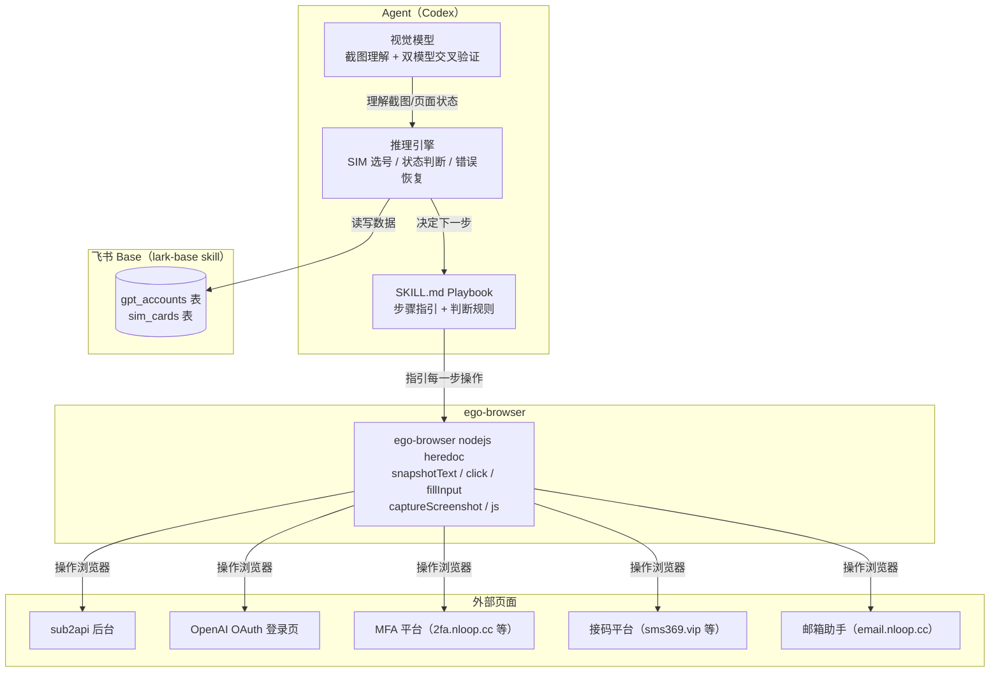
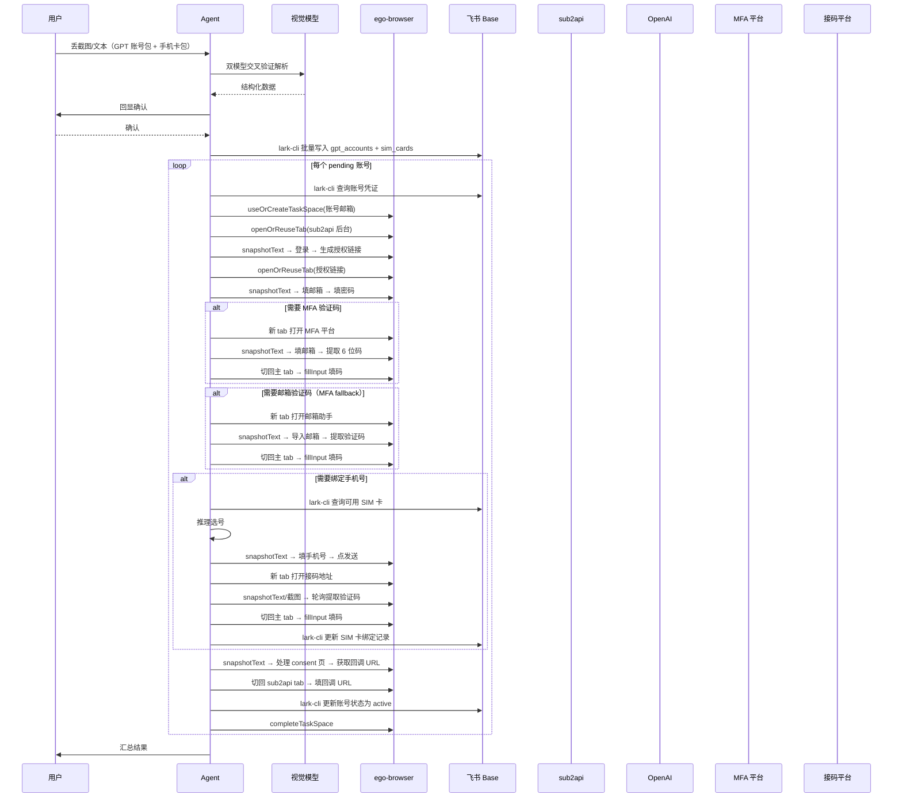

# sub2api-auth 扩展设计：ego-browser 驱动 + MFA/短信/飞书 Base

## 1. 目标与范围

在现有 `sub2api-auth` skill 基础上，用 ego-browser + agent playbook 架构替代现有 Playwright 硬编码脚本，补齐三个缺失能力：

1. **MFA 一次性密码自动获取** — 从接码/2FA 平台（如 `2fa.nloop.cc`）实时抓取当前有效的 6 位 TOTP 码，填入 OpenAI 登录验证页。
2. **手机绑定 + 短信验证码自动获取** — 在 OpenAI 要求绑定手机号时，自动从 SIM 池选号、填入、触发发送，再从接码平台（如 `sms369.vip`）轮询短信验证码并回填。
3. **飞书 Base 持久化** — 所有账号凭证、MFA 平台信息、手机号池、绑定历史、冷却/过期状态统一存入飞书多维表格，作为唯一真相源。脚本运行时直接读写飞书，不做本地缓存。

附带能力：

+ **Provider 文档解析** — 用户丢截图或文本时，用双视觉模型交叉验证提取结构化信息，回显确认后写入飞书 Base。
+ **SIM 池复用管理** — 全局手机号池，跨订单复用，单号上限 3 次绑定，每次绑定后冷却 3 天，有效期 25–30 天过期作废，撞 recently-used 自动换号。
+ **重新授权** — 掉 OAuth 授权时，从飞书 Base 读取完整凭证，无需人工整理 accounts.txt。
+ **Self-healing** — 遇到未知 UI 时 agent 截图理解、尝试操作，实在搞不定才 handoff 给用户。成功处理的新 UI 模式记录到 references/ 供后续复用。

不在范围内：sub2api 后台 ban 状态扫描（`check_all_ban_status.mjs` 保留为独立工具脚本）。

## 2. 架构概览

### 核心转变：从脚本驱动到 agent 驱动

现有 `authorize-openai-oauth.mjs`（2905 行）的核心痛点是用硬编码 selector 猜测页面结构。每换一个 provider 或 OpenAI 改一次 UI，就得回来改代码。新架构用 ego-browser 的 `snapshotText()` / `captureScreenshot()` 让 agent 实时观察页面，用视觉模型理解当前状态，用推理决定下一步动作——不需要预先写任何 selector。



### 与现有架构的对比

| 维度 | 旧架构（Playwright 脚本） | 新架构（ego-browser + agent） |
|------|--------------------------|-------------------------------|
| UI 交互 | 硬编码 selector + 几十个 fallback | agent 看页面实时决定 |
| 新 provider 适配 | 改代码加 selector | 不需要改代码，agent 现场理解 |
| 未知 UI 处理 | 卡死或报错 | 截图理解 → 尝试 → handoff |
| 运行方式 | `node src/xxx.mjs` 一键跑 | agent 按 playbook 逐步执行 heredoc |
| 速度 | 快（纯脚本） | 较慢（每步有模型推理延迟） |
| 维护成本 | 高（UI 一变就要改代码） | 低（playbook 是自然语言，适应性强） |
| 浏览器隔离 | Playwright 独立 profile | ego-browser task space，复用用户登录态 |

### 保留的现有组件

+ `check_all_ban_status.mjs` — 保留为独立工具脚本，用于只读 ban 状态扫描。可后续也迁移到 ego-browser，但不在本期范围。
+ `references/local-wsl-operations.md` — 保留 WSL 环境操作笔记，更新飞书 Base 配置部分。

### 废弃的现有组件

+ `src/authorize-openai-oauth.mjs` — 其 OpenAI 登录 + 验证 + 手机绑定 + 回调逻辑被 playbook 替代。sub2api 后台操作也被 playbook 替代。整个文件不再作为主入口。
+ `accounts.txt` / `accounts.example.txt` — 凭证来源改为飞书 Base，不再需要文本文件。

## 3. 数据模型（飞书 Base）

### 表 1：gpt_accounts

| 字段名 | 类型 | 说明 |
|--------|------|------|
| email | 文本 | 主键，GPT 账号邮箱 |
| password | 文本 | 登录密码（明文，飞书云端存储） |
| source_order | 文本 | 来源订单号（如 LD26072731CVWM） |
| source_provider | 文本 | provider 名称（如"链动小铺"） |
| mfa_platform_url | 文本 | MFA 取码平台地址（如 https://2fa.nloop.cc/） |
| mfa_platform_type | 单选 | 网页 / API |
| email_helper_url | 文本 | 邮箱验证码平台地址（如 https://email.nloop.cc/），可为空 |
| bound_phone | 文本 | 当前绑定的手机号 |
| sub2api_status | 单选 | pending / active / revoked / banned / failed / manual_required |
| auth_time | 日期 | 首次授权成功时间 |
| last_reauth_time | 日期 | 最近一次重新授权时间 |
| notes | 文本 | 备注（自由文本，如 provider 特殊说明） |

### 表 2：sim_cards

| 字段名 | 类型 | 说明 |
|--------|------|------|
| phone_number | 文本 | 主键，手机号（含国际区号，如 13103887887） |
| sms_url | 文本 | 接码地址（完整 URL 含 token） |
| sms_type | 单选 | 网页 / API / unknown |
| source_order | 文本 | 来源订单号 |
| bound_accounts | 文本 | 已绑定的 GPT 邮箱列表，逗号分隔 |
| bind_count | 数字 | 累计绑定次数 |
| last_bind_time | 日期 | 最近一次绑定时间 |
| cooldown_until | 日期 | 冷却到期时间（绑定后 +3 天） |
| valid_until | 日期 | 有效期到期时间（购买后 +25~30 天） |
| status | 单选 | available / cooldown / expired / exhausted / unavailable |
| notes | 文本 | 备注 |

### 不建 provider_configs 表

YAGNI。同一家 provider 的共享信息（默认密码、MFA 平台地址）在解析时直接冗余写入每条 gpt_accounts 记录。等第二次遇到同一家 provider 且用户明确说"格式一样"时再加缓存表。

## 4. 组件设计

### 4.1 SKILL.md Playbook（替代 authorize-openai-oauth.mjs）

SKILL.md 不再是"调用脚本的说明文档"，而是 agent 的操作手册。它包含：

+ **触发条件**：用户丢 GPT 账号包截图/文本、说"授权"、"重新授权"、"添加账号"等。
+ **Provider 解析流程**：收到截图后的双视觉模型交叉验证 + 结构化提取 + 回显确认 + 写入飞书 Base。
+ **新增授权 playbook**：逐步指引 agent 完成一个账号的完整授权流程。
+ **重新授权 playbook**：从飞书 Base 读 revoked 账号，复用新增授权流程。
+ **SIM 池选号规则**：选号优先级、冷却/过期/上限判断、换号重试逻辑。
+ **已知 UI 模式库**：references/known-ui-patterns.md 里记录已验证的页面操作序列，agent 遇到已知平台时直接套用，遇到未知平台时现场理解并追加记录。

Playbook 的每一步遵循统一的 observe-act-verify 循环：

1. **Observe**：`snapshotText()` 获取语义化页面结构，必要时 `captureScreenshot()` 截图给视觉模型理解。
2. **Reason**：agent 根据页面内容判断当前处于流程的哪个阶段、下一步该做什么。
3. **Act**：用 `click()`、`fillInput()`、`typeText()` 等操作页面。
4. **Verify**：再次 observe，确认操作生效、页面进入预期状态。

### 4.2 ego-browser 使用方式

每个账号的授权流程使用一个 ego-browser task space。流程结束后 `completeTaskSpace` 关闭。

**sub2api 后台操作**（登录、生成授权链接、填回调 URL）：agent 在 task space 里打开 sub2api 后台页面，用 snapshotText 观察 UI，用 click/fillInput 操作。sub2api 后台是标准 Web 表单，语义化 workflow 足够。

**OpenAI OAuth 登录页**：agent 打开授权链接，观察登录页，填邮箱密码，处理 Cloudflare challenge（如果出现），处理 MFA/邮箱验证码/手机绑定。OpenAI 页面可能有 Cloudflare 保护，ego-browser 复用用户登录态和真实浏览器指纹，比 Playwright + Camofox 更自然。

**MFA 平台**（如 2fa.nloop.cc）：agent 在新 tab 打开 MFA 平台，snapshotText 找到邮箱输入框，填入邮箱，等待验证码出现，提取 6 位码。

**接码平台**（如 sms369.vip）：agent 在新 tab 打开接码地址，snapshotText 或截图观察页面，轮询提取短信验证码。首次打开时 probe 判断是网页还是 API 响应。

**邮箱助手**（如 email.nloop.cc）：作为 MFA 的 fallback，当 MFA 平台取不到码时使用。

**多 tab 管理**：一个 task space 内可以同时开多个 tab——主 tab 跑 OpenAI 登录流程，辅助 tab 打开 MFA 平台或接码平台取码，取完切回主 tab 填码。

### 4.3 飞书 Base 读写（lark-base skill）

agent 通过 lark-base skill（lark-cli 命令）直接读写飞书 Base，不写自定义 wrapper 脚本。

+ **写入**：解析完 provider 文档后，用 lark-cli 批量创建 gpt_accounts 和 sim_cards 记录。
+ **读取**：授权流程开始时，用 lark-cli 查询 sub2api_status=pending 或 revoked 的账号。
+ **更新**：授权成功/失败后，用 lark-cli 更新对应记录的状态字段。
+ **SIM 池查询**：选号时用 lark-cli 查询 status=available 且未过期且未冷却且 bind_count<3 的记录。

飞书 API 凭证（app_id/app_secret 或 user_access_token）通过环境变量或 lark-cli 已配置的认证传入。

**Base 初始化**：首次使用时，agent 用 lark-cli 创建多维表格和两张表，字段类型按第 3 节定义。app_token 和 table_id 记录到 .env 或 SKILL.md 的配置说明中。

### 4.4 SIM 池选号逻辑（agent 推理）

不需要单独的 sim-pool.mjs 脚本。选号逻辑足够简单，agent 在推理时直接执行：

1. 用 lark-cli 查询 sim_cards 表中 status=available 的记录。
2. 过滤掉 valid_until 已过期的（标记为 expired）。
3. 过滤掉 cooldown_until 还未到的。
4. 过滤掉 bind_count >= 3 的（标记为 exhausted）。
5. 排除本轮已试过的号码。
6. 按 bind_count 升序排序，取第一个。
7. 全部不满足则返回 null，账号标记 manual_required。

绑定成功后更新：bind_count+1、last_bind_time=now、cooldown_until=now+3天、bound_accounts 追加邮箱。

撞 recently-used 时更新：status=unavailable、cooldown_until=now+1小时、notes 追加原因。

### 4.5 Provider 文档解析（agent 交互流程）

这不是运行时模块，而是 SKILL.md 里的交互指引。agent 收到截图后：

1. 用两个视觉模型各读一遍截图中的密码、密钥、URL 等关键字符串。
2. 两边一致则采用。不一致则找用户确认。
3. HTML 实体解码（`&#26;` → `&` 等）。
4. 提取结构化数据：GPT 账号列表（邮箱 + 统一密码）、MFA 平台地址、手机号列表 + 接码地址。
5. 回显给用户确认。
6. 确认后用 lark-cli 批量写入飞书 Base。

解析规则（从真实样本归纳）：

+ GPT 账号包：卡密列表每行一个邮箱；密码在"使用说明"里的"登录密码默认：xxx"；MFA 地址在"MFA 接码地址：xxx"。
+ 手机卡包：卡密列表每行格式为 `手机号|接码地址` 或 `手机号----接码地址`（两种分隔符都认）。
+ 一次可能含多个包：逐包解析，合并写入。

### 4.6 已知 UI 模式库（references/known-ui-patterns.md）

agent 每次成功处理一个平台的 UI 后，将截图描述 + 操作序列追加到这个文件。下次遇到同一平台时直接套用已知模式，跳过"现场理解"步骤，加快速度。

格式示例：

```markdown
## 2fa.nloop.cc — MFA 取码

页面结构：左侧"添加 MFA 密钥"面板（不用管），右侧"验证码"面板。
操作序列：
1. snapshotText 找到右侧"粘贴邮箱"输入框（通常有 @ 前缀提示）
2. fillInput 填入目标邮箱
3. 等待 2-3 秒，再次 snapshotText
4. 在结果区域找 6 位数字（大号字体显示，旁边有倒计时秒数）
5. 如果倒计时 < 5 秒，等下一轮刷新再取

## sms369.vip — 短信接码（网页模式）

页面结构：打开 token URL 后显示短信列表。
操作序列：
1. openOrReuseTab 打开接码 URL
2. snapshotText 查看页面内容
3. 在文本中匹配 4-8 位数字验证码
4. 如果没有，等 5 秒刷新页面重试，最长 120 秒
```

## 5. 数据流

### 5.1 新增授权流程



### 5.2 重新授权流程

与新增授权相同，区别在于：

+ 入口触发：用户说"重新授权"、"check revoked"，或 agent 主动扫描。
+ 从飞书 Base 查 sub2api_status=revoked 的账号（或用户指定邮箱）。
+ 凭证全部从飞书 Base 读，不依赖 sub2api 备注或 accounts.txt。
+ 如果原绑定手机号仍在冷却/过期/不可用，从 SIM 池重新选号。

### 5.3 手机绑定详细流程

agent 在 observe 阶段判断当前页面是否出现手机绑定 UI。判断依据：snapshotText 或截图中出现 `phone number`、`Check your phone`、`Enter the verification code we just sent to`、`添加电话号码` 等关键词。

如果没出现，跳过（有些账号不需要重新绑手机）。

如果出现：

1. 从飞书 Base 查可用 SIM 卡，推理选号。
2. snapshotText 找到手机号输入框，fillInput 填入号码。注意国际区号：观察页面是否有国家下拉框或 `+1` 前缀输入框，按实际 UI 处理。
3. click 发送按钮（Continue / Send code）。
4. 等 3 秒，在新 tab 打开接码地址，轮询验证码（每 5 秒 snapshotText 一次，最长 120 秒）。
5. 如果接码页面显示"无法向此号码发送验证码"或 "This phone number was recently used"：标记该号 unavailable + 1 小时冷却，换号重试（最多 3 次）。
6. 如果拿到验证码：切回主 tab，fillInput 填入，click Continue。
7. 3 次换号都失败：账号标记 manual_required，completeTaskSpace，跳过。

## 6. 错误处理

| 场景 | 处理方式 |
|------|----------|
| MFA 平台打不开/超时 | agent 截图记录，fallback 到邮箱验证码；邮箱也没有则标记 manual_required |
| MFA 平台显示邮箱未绑定 | 同上 fallback |
| 接码平台打不开 | 标记该 SIM 卡 unavailable，换号重试 |
| 手机号被 OpenAI 拒绝 | 标记 unavailable + 1 小时冷却，换号重试 |
| SIM 池无可用号码 | 账号标记 manual_required，汇总报告 |
| 飞书 Base API 限流/断网 | agent 报错告知用户（不做本地缓存） |
| OpenAI 登录页出现未知 UI | agent 截图理解 → 尝试操作 → 搞不定则 handoff 给用户 |
| 密码错误 | 标记 failed，notes 记录错误信息 |
| Cloudflare challenge | ego-browser 复用真实浏览器指纹，通常自动通过；卡住则 handoff |
| ego-browser "user is controlling" | 停止操作，等用户确认 continue 后 takeOverTaskSpace |

## 7. 安全与凭证处理

+ 密码、接码 token、MFA 平台地址均以明文存飞书 Base。消耗品账号凭证，用户已确认接受云端存储风险。
+ 飞书 API 凭证通过 lark-cli 已配置的认证或 .env 文件传入。
+ agent 在 commentary/final 输出中对密码和 token 做 redact。
+ sub2api 备注字段不再存任何凭证信息。
+ ego-browser task space 隔离：agent 操作不影响用户正常浏览。

## 8. 测试策略

按 AGENTS.md 原则，业务 payload 必须来自真实数据，不编造。

+ **Playbook 验证**：用一个真实 pending 账号跑完整新增授权流程，验证 playbook 每一步的 observe-act-verify 循环正确。需要用户授权执行。
+ **Provider 解析验证**：用本次用户提供的两张截图作为测试样本，验证双视觉模型解析 + 回显确认流程。
+ **SIM 池选号验证**：在飞书 Base 中构造几种状态组合（available + cooldown + expired + exhausted），验证 agent 推理选号逻辑正确。
+ **回归**：`check_all_ban_status.mjs` 在修改后仍需正常工作。
+ **已知 UI 模式积累**：每次成功处理后更新 known-ui-patterns.md，逐步覆盖所有遇到的平台。

## 9. 文件结构变更

```
skills/sub2api-auth/
├── SKILL.md                              # 重写：agent playbook + 触发条件 + 配置说明
├── references/
│   ├── known-ui-patterns.md             # 新增：已知平台 UI 操作模式库
│   ├── local-wsl-operations.md          # 保留更新：飞书 Base 配置
│   └── provider-parse-rules.md          # 新增：provider 文档解析规则（从真实样本归纳）
├── check_all_ban_status.mjs             # 保留：独立 ban 状态扫描工具
├── .env.example                          # 更新：飞书凭证变量
├── package.json                          # 可精简：不再需要 playwright 依赖（ego-browser 自带浏览器）
└── src/
    └── authorize-openai-oauth.mjs       # 废弃：不再作为主入口，保留供参考
```

## 10. 环境变量

```
# 飞书 Base 配置（如果 lark-cli 未配置认证）
FEISHU_APP_ID=cli_xxxx
FEISHU_APP_SECRET=xxxx
FEISHU_BASE_APP_TOKEN=xxxx
FEISHU_TABLE_GPT_ACCOUNTS=tblXxx
FEISHU_TABLE_SIM_CARDS=tblYyy

# sub2api 后台（agent 通过 ego-browser 操作，但仍需知道 URL）
SUB2API_ADMIN_URL=http://<sub2api-host>:8080/admin/accounts
```

不再需要：`SUB2API_ADMIN_EMAIL`、`SUB2API_ADMIN_PASSWORD`（agent 通过 ego-browser 登录 sub2api，可以复用用户登录态或首次 handoff 让用户登录）、Playwright 相关变量、Camofox 相关变量。

## 11. 双视觉模型交叉验证规则

写入 SKILL.md 作为硬规则：

1. 每次解析截图中的密码、密钥、URL、token 等关键字符串时，必须用两个视觉模型各读一遍。
2. 两边结果完全一致则采用。
3. 两边不一致则停下来找用户确认，不得自行选择。
4. 解析完成后，将结构化结果原样回显给用户，等用户确认后再写入飞书 Base 和执行授权。

## 12. 开放问题（实现时决定）

+ 飞书 Base 的 `bound_accounts` 字段用文本逗号分隔还是飞书关联字段？实现时看 lark-base API 对关联字段的支持程度决定。
+ SMS 接码平台的 API 模式具体 JSON 结构？实现时先对真实 URL 做一次 probe，记录响应结构再写进 known-ui-patterns.md。
+ OpenAI 手机绑定页的国际区号输入方式？实现时用 ego-browser snapshotText/截图确认 UI 结构，记录到 known-ui-patterns.md。
+ ego-browser 能否自动通过 OpenAI 的 Cloudflare challenge？实现时实测，如果不能则 handoff 让用户手动过 challenge 后 agent 接管。
+ sub2api 后台登录是否需要每次 handoff 让用户登录？如果 ego-browser 能复用用户登录态则不需要；如果不能，首次 handoff 登录后后续复用 task space 或 cookie。
