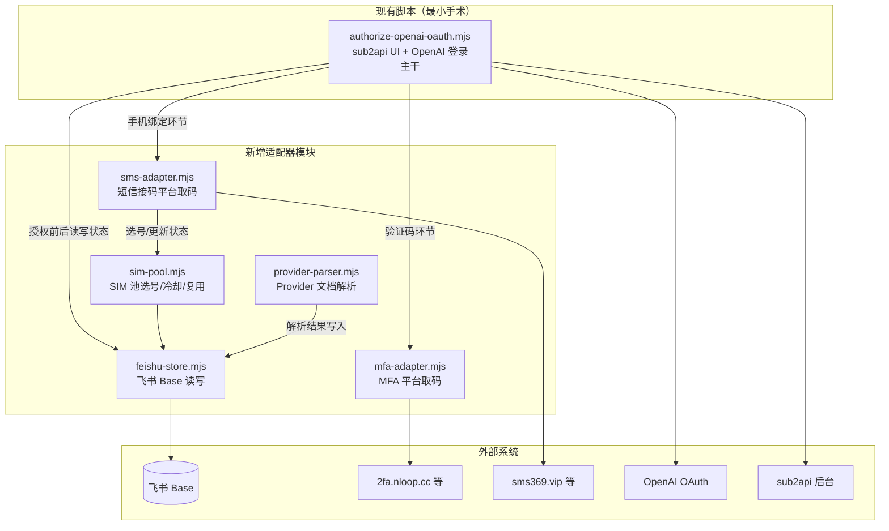
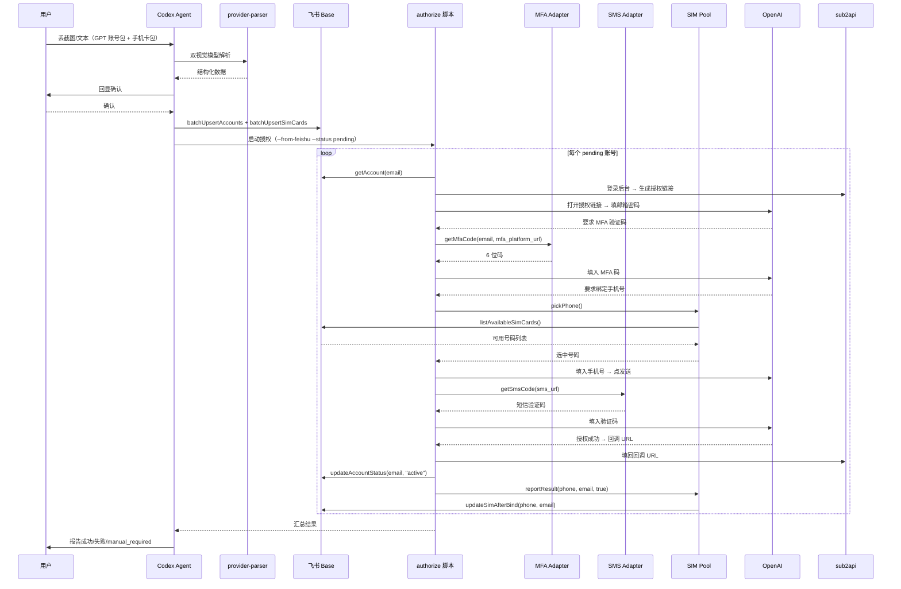

# sub2api-auth 扩展设计：MFA 取码 + 短信接码 + 飞书 Base 持久化

## 1. 目标与范围

在现有 `sub2api-auth` skill 基础上，补齐三个缺失能力：

1. **MFA 一次性密码自动获取** — 从接码/2FA 平台（如 `2fa.nloop.cc`）实时抓取当前有效的 6 位 TOTP 码，填入 OpenAI 登录验证页。
2. **手机绑定 + 短信验证码自动获取** — 在 OpenAI 要求绑定手机号时，自动从 SIM 池选号、填入、触发发送，再从接码平台（如 `sms369.vip`）轮询短信验证码并回填。
3. **飞书 Base 持久化** — 所有账号凭证、MFA 平台信息、手机号池、绑定历史、冷却/过期状态统一存入飞书多维表格，作为唯一真相源。脚本运行时直接读写飞书，不做本地缓存。

附带能力：

+ **Provider 文档解析** — 用户丢截图或文本时，用双视觉模型交叉验证提取结构化信息，回显确认后写入飞书 Base。
+ **SIM 池复用管理** — 全局手机号池，跨订单复用，单号上限 3 次绑定，每次绑定后冷却 3 天，有效期 25–30 天过期作废，撞 recently-used 自动换号。
+ **重新授权** — 掉 OAuth 授权时，从飞书 Base 读取完整凭证，无需人工整理 accounts.txt。

不在范围内：sub2api 后台 UI 操作逻辑的重构（已验证可用，最小手术插入新调用）。

## 2. 架构概览

采用**适配器模式 + 最小手术**（方案 C）。现有 `authorize-openai-oauth.mjs` 的 sub2api UI 操作和 OpenAI 登录主干不动，新增独立模块在关键节点插入调用。



### 手术点（现有脚本的修改位置）

| 位置 | 现有行为 | 新增调用 |
|------|----------|----------|
| `openAIHandleVerification()` | 只去 email.nloop.cc 取邮箱验证码 | 先尝试 MFA adapter 取 TOTP 码；MFA 无结果再 fallback 到邮箱验证码 |
| `openAIHandleConsent()` 之前 | 无手机绑定处理 | 插入 `handlePhoneBinding()` — 检测是否出现手机绑定页，若有则调 SMS adapter |
| 脚本入口 `main()` | 从 accounts.txt 读凭证 | 新增 `--from-feishu` 模式：从飞书 Base 读待授权/待重授账号列表 |
| `--check-revoked` 模式 | 从 sub2api 备注读凭证 | 改为从飞书 Base 读凭证 |
| 授权成功/失败后 | 无持久化 | 调 feishu-store 更新账号状态 |

## 3. 数据模型（飞书 Base）

### 表 1：gpt_accounts

| 字段名 | 类型 | 说明 |
|--------|------|------|
| email | 文本 | 主键，GPT 账号邮箱 |
| password | 文本 | 登录密码（明文，飞书云端存储） |
| source_order | 文本 | 来源订单号（如 LD26072731CVWM） |
| source_provider | 文本 | provider 名称（如"链动小铺"） |
| mfa_platform_url | 文本 | MFA 取码平台地址（如 https://2fa.nloop.cc/） |
| mfa_platform_type | 单选 | 网页 / API |
| email_helper_url | 文本 | 邮箱验证码平台地址（如 https://email.nloop.cc/），可为空 |
| bound_phone | 文本 | 当前绑定的手机号 |
| sub2api_status | 单选 | pending / active / revoked / banned / failed / manual_required |
| auth_time | 日期 | 首次授权成功时间 |
| last_reauth_time | 日期 | 最近一次重新授权时间 |
| notes | 文本 | 备注（自由文本，如 provider 特殊说明） |

### 表 2：sim_cards

| 字段名 | 类型 | 说明 |
|--------|------|------|
| phone_number | 文本 | 主键，手机号（含国际区号，如 13103887887） |
| sms_url | 文本 | 接码地址（完整 URL 含 token） |
| sms_type | 单选 | 网页 / API / unknown |
| source_order | 文本 | 来源订单号 |
| bound_accounts | 文本 | 已绑定的 GPT 邮箱列表，逗号分隔 |
| bind_count | 数字 | 累计绑定次数 |
| last_bind_time | 日期 | 最近一次绑定时间 |
| cooldown_until | 日期 | 冷却到期时间（绑定后 +3 天） |
| valid_until | 日期 | 有效期到期时间（购买后 +25~30 天） |
| status | 单选 | available / cooldown / expired / exhausted / unavailable |
| notes | 文本 | 备注 |

### 不建 provider_configs 表

YAGNI。同一家 provider 的共享信息（默认密码、MFA 平台地址）在解析时直接冗余写入每条 gpt_accounts 记录。等第二次遇到同一家 provider 且用户明确说"格式一样"时再加缓存表。

## 4. 组件设计

### 4.1 MFA Adapter（mfa-adapter.mjs）

**职责**：给定邮箱和 MFA 平台 URL，返回当前有效的 6 位 TOTP 验证码。

**交互方式**（以 2fa.nloop.cc 为参考实现）：

1. 用 Playwright 打开 MFA 平台 URL。
2. 定位"粘贴邮箱"输入框（参考截图：右侧面板有 `@` 前缀的输入框），填入目标邮箱。
3. 等待页面渲染验证码结果区域。
4. 提取 6 位数字验证码（参考截图：大号字体显示如 `130476`，旁边有倒计时秒数）。
5. 返回验证码字符串。

**容错**：

+ 如果页面显示"无结果"或邮箱未绑定 MFA，返回 null，调用方 fallback 到邮箱验证码。
+ 如果验证码倒计时 < 5 秒，等待下一轮刷新后再取（避免取到即将过期的码）。
+ 超时 30 秒未出现验证码则返回 null。

**扩展性**：不同 MFA 平台的页面结构不同。adapter 内部用 `platformType` 参数路由到不同的提取逻辑。首期只实现 `nloop` 类型（2fa.nloop.cc），后续遇到新平台加新提取函数。

### 4.2 SMS Adapter（sms-adapter.mjs）

**职责**：给定接码地址，轮询获取短信验证码。

**交互方式**：

1. 用 Playwright 打开接码地址 URL。
2. 首次打开时 probe 页面内容：如果返回 JSON（Content-Type 含 `application/json`），标记 `sms_type=api`，后续用 fetch 轮询；如果返回 HTML，标记 `sms_type=网页`，后续用页面 DOM 轮询。
3. 轮询逻辑：每 5 秒检查一次，最长等待 120 秒。
4. 验证码提取：从页面文本或 JSON 响应中匹配 4–8 位数字验证码（OpenAI 短信验证码通常 6 位）。
5. 返回验证码字符串。

**容错**：

+ 如果 120 秒内未收到验证码，返回 null。调用方（handlePhoneBinding）标记该手机号为 unavailable，从 SIM 池换号重试。
+ 如果页面显示"无法向此号码发送验证码"或 "This phone number was recently used"，立即返回特定错误码 `PHONE_REJECTED`，不继续轮询。

### 4.3 Feishu Base Store（feishu-store.mjs）

**职责**：封装飞书 Base 的 CRUD 操作，对上层提供语义化接口。

**接口**：

```
// 账号操作
upsertAccount(record)          // 新增或更新一条 gpt_accounts 记录
getAccount(email)              // 按邮箱查单条
listAccounts(filter)           // 按条件查列表（如 sub2api_status=revoked）
updateAccountStatus(email, status, extra)  // 更新状态 + 可选附加字段

// SIM 操作
upsertSimCard(record)          // 新增或更新一条 sim_cards 记录
getSimCard(phoneNumber)        // 按号码查单条
listAvailableSimCards()        // 查所有 status=available 且未过期且未冷却且 bind_count<3 的号
updateSimAfterBind(phoneNumber, email)     // 绑定成功后更新 bind_count/last_bind_time/cooldown_until/bound_accounts
markSimUnavailable(phoneNumber, reason)    // 标记不可用 + 冷却
markSimExpired(phoneNumber)               // 标记过期

// 批量操作
batchUpsertAccounts(records)   // 批量写入（解析完一批文档后一次性写入）
batchUpsertSimCards(records)   // 批量写入
```

**实现**：使用飞书 OpenAPI（lark-cli 或直接 HTTP 调用）。需要 app_id/app_secret 或 user access token。凭证通过环境变量或 .env 文件传入，不硬编码。

**Base 定位**：首次运行时通过配置指定 `app_token` 和两张表的 `table_id`。如果表不存在，提供 `--init-tables` 命令自动创建。

### 4.4 SIM Pool Manager（sim-pool.mjs）

**职责**：封装选号逻辑，对上层只暴露 `pickPhone()` 和 `reportResult()`。

**选号逻辑 `pickPhone(excludePhones)`**：

1. 从飞书 Base 查 `listAvailableSimCards()`。
2. 排除 `excludePhones` 列表中的号码（本轮已经试过的）。
3. 优先选 `bind_count` 最小的（均匀分配）。
4. 如果全部不满足条件，返回 null。调用方将该账号标记为 `manual_required`。

**结果回报 `reportResult(phoneNumber, email, success, errorCode)`**：

+ 成功：调 `updateSimAfterBind(phoneNumber, email)`。
+ `PHONE_REJECTED`：调 `markSimUnavailable(phoneNumber, "recently_used")`，cooldown 设为 1 小时。
+ 其他失败：不改变 SIM 状态（可能是网络问题，下次还能用）。

### 4.5 Provider Doc Parser（provider-parser.mjs）

**职责**：将用户丢来的截图或文本解析为结构化数据。

**这个模块不是脚本运行时调用的**——它是 Codex agent 在交互时使用的流程指引，写在 SKILL.md 里。agent 收到截图后：

1. 用两个视觉模型各读一遍截图中的密码、密钥、URL 等关键字符串。
2. 两边一致则采用。不一致则找用户确认。
3. 提取结构化数据：GPT 账号列表（邮箱 + 统一密码）、MFA 平台地址、手机号列表 + 接码地址。
4. 回显给用户确认。
5. 确认后调 `feishu-store.batchUpsertAccounts()` 和 `batchUpsertSimCards()` 写入飞书 Base。

**解析规则**（从真实样本归纳）：

+ GPT 账号包：卡密列表每行一个邮箱；密码在"使用说明"里的"登录密码默认：xxx"；MFA 地址在"MFA 接码地址：xxx"。
+ 手机卡包：卡密列表每行格式为 `手机号|接码地址` 或 `手机号----接码地址`（两种分隔符都认）。
+ HTML 实体解码：`&#26;` 转为 `&`，`&#35;` 转为 `#` 等，解析后做 HTML entity decode。
+ 一次可能含多个包：agent 逐包解析，合并写入。

## 5. 数据流

### 5.1 新增授权流程



### 5.2 重新授权流程

与新增授权相同，区别在于：

+ 入口是 `--check-revoked` 或 `--reauth <email>`。
+ 从飞书 Base 读 `sub2api_status=revoked` 的账号（或指定邮箱）。
+ 凭证（密码、MFA 平台、绑定手机号）全部从飞书 Base 读，不再依赖 sub2api 备注或 accounts.txt。
+ 如果原绑定手机号仍在冷却/过期/不可用，从 SIM 池重新选号。

### 5.3 handlePhoneBinding() 详细流程

这是现有脚本中**完全新增**的函数，插入在 `openAIHandleVerification()` 之后、`openAIHandleConsent()` 之前：

1. 检测当前页面是否出现手机绑定 UI（关键词：`phone number`、`Check your phone`、`Enter the verification code we just sent to`、`添加电话号码`）。
2. 如果没出现，直接返回（有些账号可能不需要重新绑手机）。
3. 如果出现，从 SIM 池 `pickPhone()` 获取号码。
4. 在手机号输入框填入号码（注意国际区号格式：OpenAI 通常要 `+1` 前缀或下拉选国家）。
5. 点击"Continue"/"Send code" 按钮。
6. 等待 3 秒后调 SMS adapter 轮询验证码。
7. 如果 SMS adapter 返回 `PHONE_REJECTED`：标记该号不可用，回到步骤 3 换号重试（最多 3 次）。
8. 如果 SMS adapter 返回验证码：填入验证码输入框，点击 Continue。
9. 如果 3 次换号都失败：将账号标记为 `manual_required`，跳过。

## 6. 错误处理

| 场景 | 处理方式 |
|------|----------|
| MFA 平台打不开/超时 | 返回 null，fallback 到邮箱验证码；邮箱验证码也没有则标记 `manual_required` |
| MFA 平台显示邮箱未绑定 | 返回 null，同上 fallback |
| 短信接码平台打不开 | 标记该 SIM 卡 `unavailable`，换号重试 |
| 手机号被 OpenAI 拒绝（recently used） | 标记该 SIM 卡 `unavailable` + 1 小时冷却，换号重试 |
| SIM 池无可用号码 | 账号标记 `manual_required`，汇总报告 |
| 飞书 Base API 限流/断网 | 脚本直接报错退出（不做本地缓存，断网本身就完不成授权） |
| OpenAI 登录页出现未知 UI | 截图保存 + 标记 `manual_required`，不卡死流程 |
| 密码错误（登录失败） | 标记 `failed`，记录错误信息到 notes |

## 7. 安全与凭证处理

+ 密码、接码 token、MFA 平台地址均以明文存飞书 Base。这些是消耗品账号的凭证，用户已确认接受云端存储风险。
+ 飞书 API 凭证（app_id/app_secret 或 user_access_token）通过 `.env` 文件传入，`.env` 在 `.gitignore` 中。
+ 脚本日志中密码和 token 做 redact（现有 `redactRaw()` 函数已处理 `tok_` 和 `----` 之间的密码，需扩展覆盖接码 URL 中的 token 参数）。
+ sub2api 备注字段不再存任何凭证信息。

## 8. 测试策略

按 AGENTS.md 原则，业务 payload 必须来自真实数据，不编造。

+ **单元测试**：SIM 池选号逻辑（mock 飞书 Base 返回，验证选号优先级、冷却排除、上限排除）、HTML 实体解码、账号行解析（用脱敏真实样本）。
+ **适配器集成测试**：MFA adapter 和 SMS adapter 用 Playwright 对真实平台做 smoke test（需要网络，标记为 `@live`，CI 中跳过）。
+ **端到端测试**：用一个真实 pending 账号跑完整流程，验证飞书 Base 状态更新正确。需要用户授权执行。
+ **回归**：现有 `--accounts` 和 `--check-revoked` 流程在修改后仍需通过（用现有 accounts.txt 样本跑 dry-run 或真实跑）。

## 9. 文件结构变更

```
skills/sub2api-auth/
├── SKILL.md                          # 更新：新增 provider 解析流程、飞书 Base 配置说明
├── src/
│   ├── authorize-openai-oauth.mjs    # 最小手术：插入适配器调用
│   ├── mfa-adapter.mjs              # 新增
│   ├── sms-adapter.mjs              # 新增
│   ├── feishu-store.mjs             # 新增
│   └── sim-pool.mjs                 # 新增
├── references/
│   └── local-wsl-operations.md      # 更新：飞书 Base 配置
├── .env.example                      # 更新：新增飞书凭证变量
└── package.json                      # 更新：新增飞书 SDK 依赖（如需要）
```

## 10. 环境变量新增

```
# 飞书 Base 配置
FEISHU_APP_ID=cli_xxxx
FEISHU_APP_SECRET=xxxx
FEISHU_BASE_APP_TOKEN=xxxx          # 多维表格的 app_token
FEISHU_TABLE_GPT_ACCOUNTS=tblXxx    # gpt_accounts 表的 table_id
FEISHU_TABLE_SIM_CARDS=tblYyy       # sim_cards 表的 table_id
```

## 11. 双视觉模型交叉验证规则

写入 SKILL.md 作为硬规则：

1. 每次解析截图中的密码、密钥、URL、token 等关键字符串时，必须用两个视觉模型各读一遍。
2. 两边结果完全一致则采用。
3. 两边不一致则停下来找用户确认，不得自行选择。
4. 解析完成后，将结构化结果（邮箱列表、密码、MFA 地址、手机号列表、接码地址）原样回显给用户，等用户确认后再写入飞书 Base 和执行授权。

## 12. 开放问题（实现时决定）

+ 飞书 Base 的 `bound_accounts` 字段用文本逗号分隔还是飞书关联字段？实现时看 lark-base API 对关联字段的支持程度决定。
+ SMS adapter 的 API 模式具体 JSON 结构？实现时先对 `sms369.vip/api/sms/access?token=...` 做一次 probe，记录真实响应结构再写解析逻辑。
+ OpenAI 手机绑定页的国际区号输入方式？实现时用 Playwright 截图确认 UI 结构再写选择器。
